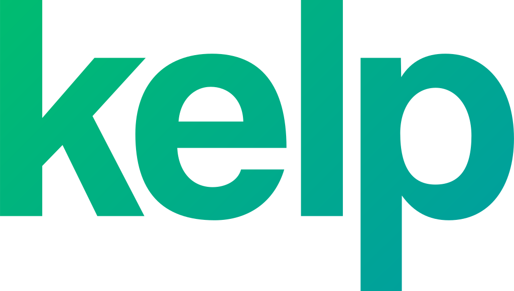
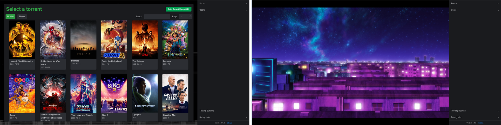

  

A slimy torrent downloader, temporary hosting & playback syncing server.

  

## [What is kelp?](#what-is-kelp) | [Features](#features) | [Setup](#setup) | [Important](#important)

## What is kelp?
  kelp (with a lowercase 'k') is a temporary torrent downloading, video hosting and playback syncing server.

  kelp is intended to be hosted on a server with a good internet connection. It allows users to generate a room to allow other users to join via a URL. 

  The host before inviting users will enter a torrent/magnet URL and the server will begin downloading it. Once downloaded and users are invited, a player will appear and the host can optionally grant all or each user controller access to pause/play/skip throughout the video from the torrent.

  Once the room has been set as 'dry' (no users or playback for the configured time) the server will delete the video to save space (configurable).

## Features
  - No database, no logins, all temporary! (BYO authentication)
  - Supports MKV, MP4 and AVI (finds first matching file in torrent)
  - Simultaneous room support (room limit configurable)
  - Playback syncing with other users in the room
  - Extracts subtitles if found

## Setup
  1. Clone the repository, and navigate to the root folder (containing the package.json file) in the terminal/command prompt
  2. Ensure you have [ffmpeg](https://ffmpeg.org/) installed. Check with `$ ffmpeg -version`
  3. Install packages with `$ npm install`
  4. Rename the `template.env` file to `.env`, then edit it to your configuration
  5. Run with `$ npm start`, and enjoy!

## Important
  **Before using, you must know that, I [(Zachary)](https://github.com/zacimac) and all contribuitors are not responsible for any torrents downloaded on YOUR instance of ['kelp'](https://github.com/zacimac/kelp) (such as legal, viruses, etc). Use at your own risk.** *Maybe use some sort of VPN on whatever its hosted on? (any VPN sponsors? :eyes:)*

  [❤️ **Also maybe considor sponsoring me so I can work on projects like this more often?**](https://github.com/sponsors/zacimac)

## Development
To get started with development of kelp, follow the setup as normal and instead of last step, use `$ npm run dev` instead.

If intending to edit conversion/playback/player etc, it may be useful to create a `src/test` folder and a `video.mp4` or `video.mkv` files can be placed in the test folder to use in the ['Testing buttons' menu](https://i.zachary.lol/firefox_UPLs2I1QPQ.png).